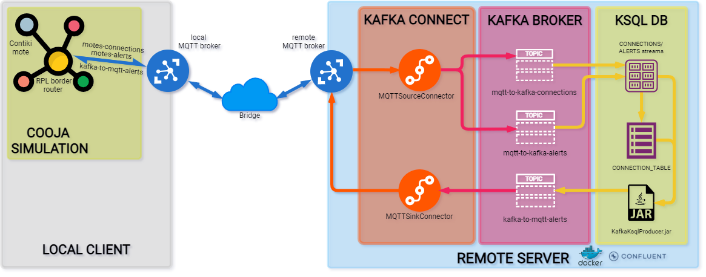
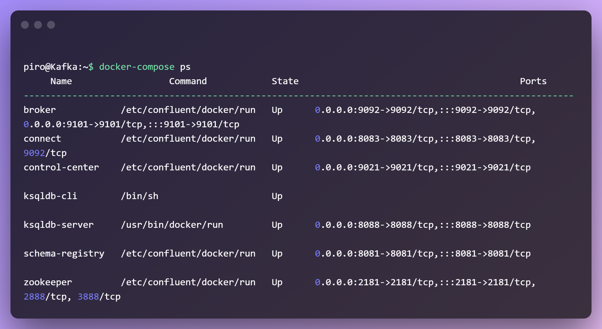
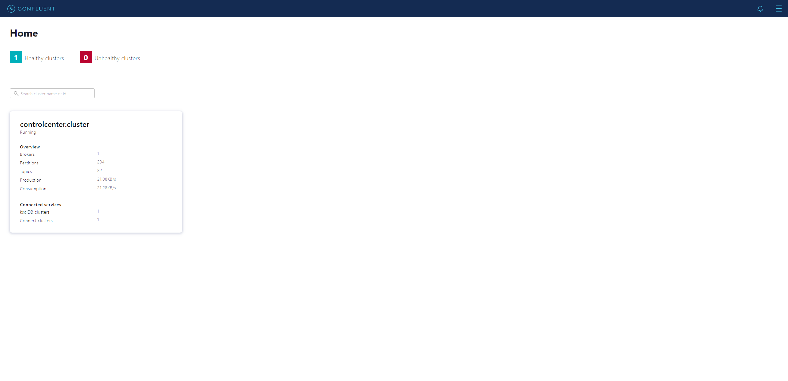
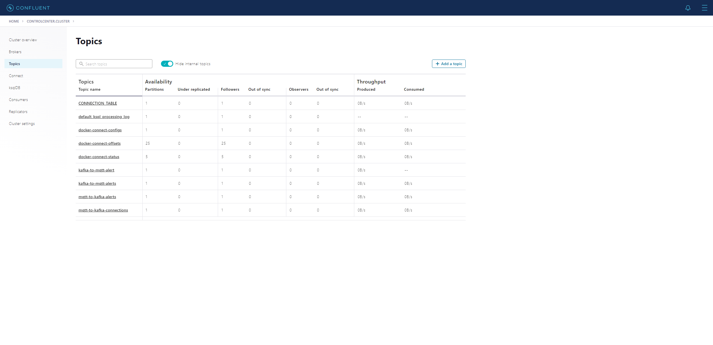
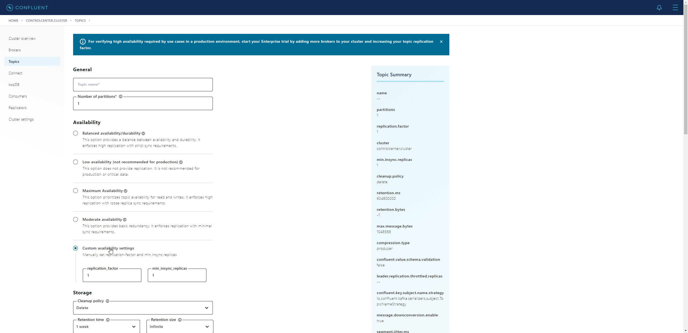
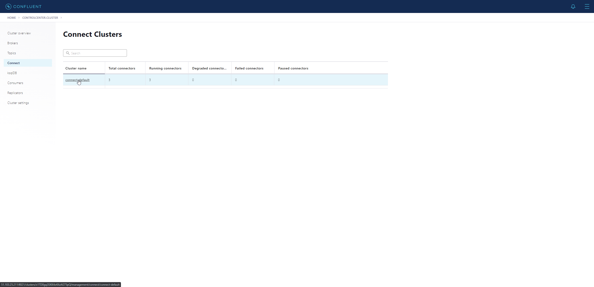
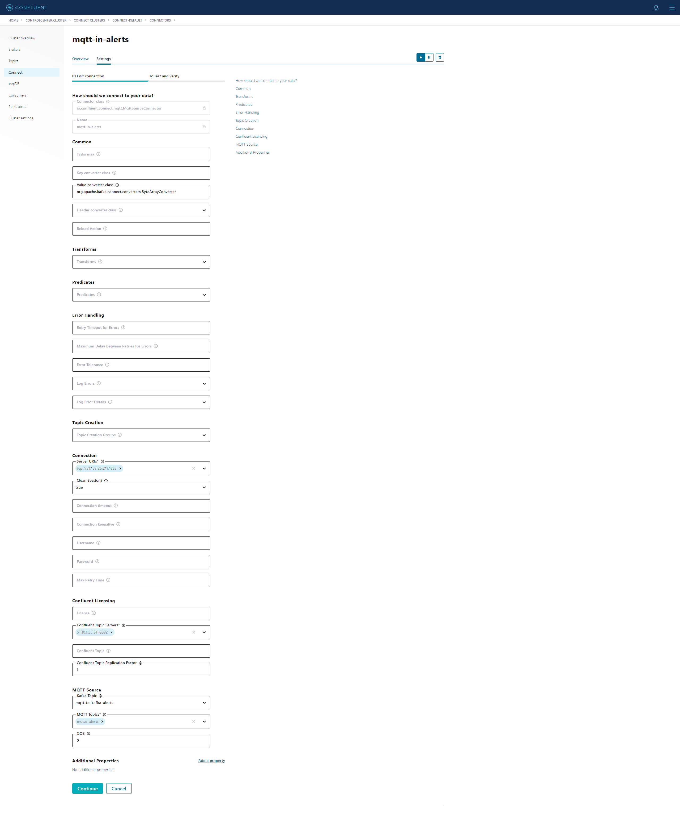
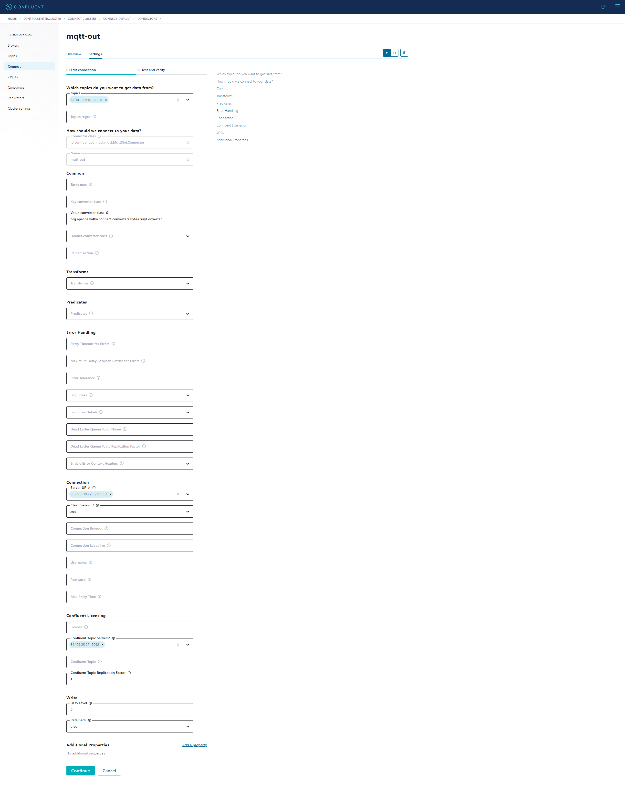

# Contiki-NG with Apache Kafka Contact Tracing


A simple integration between Apache Kafka and Contiki-NG.

## Description

This project is part of an assignment for Middleware course at Politecnico di Milano Year 2021.

It consists in a contact tracing implementation using IoT devices with Contiki-NG (with custom processes) and Apache Kafka as the middleware layout for the backend.

Each mote communicates with the other ones using UDP, reports these connections via MQTT to the Kafka cluster, which it stores them into a KSQL db.

At random intervals, the motes send alerts to the broker which then publishes via MQTT the event later caught by each mote involved.

## Specification

Full specification can be found [**here**](../specs/specification.pdf) under Project 1 section.

## Architecture



The general Architecture consists into:

- Contiki motes with a RPL Border Router for communication between them and outsides networks.
- 2 MQTT brokers, one acting in bridge mode and the other one on the remote server.
- 2 Kafka Connect connectors transferring from MQTT topics to Kafka ones.
- Apache Kafka system with a cluster, a broker and multiple topics.
- 2 KSQL streams, one for connections between nodes and the other one for incoming alerts.
- One KSQL table for storing connections.
- One jar program querying the table and instantiating a Kafka producer in order to publish on a topic.

## Platforms

- [**Cooja simulator**](https://github.com/contiki-ng/contiki-ng/wiki/Tutorial:-Running-Contiki%E2%80%90NG-in-Cooja): realtime simulation of Contiki IoT motes.
- [**Confluent Platform**](https://www.confluent.io/product/confluent-platform/): deployment of Apache Kafka with a view to enterprise production and distribution.
- [**Docker**](https://www.docker.com/): easy management of Apache Kafka and Confluent Platform with images and containers.

## Documentation

You can find detailed documentation at:
- [**contact-tracing.c doxygen**](https://s0nn1.gitlab.io/doxygen-middleware/)
- [**KafkaKsqlProducer javadocs**](https://s0nn1.github.io/javadoc-middleware/)

## Requirements

- [Docker](https://docs.docker.com/get-docker/) (remote server).
- [Java JDK 16](https://openjdk.java.net/projects/jdk/16/) (remote server).

## Installation

### Client side

**Contiki-NG**

In order to work Contiki-NG needs a few dependencies, you can use different options:

- Docker image: [here](https://github.com/contiki-ng/contiki-ng/wiki/Docker).
- Native toolchain installation (Linux): [here](https://github.com/contiki-ng/contiki-ng/wiki/Toolchain-installation-on-Linux)
- Virtual Image running on Virtualbox: [here](https://polimi365-my.sharepoint.com/:u:/g/personal/10569272_polimi_it/EasqwVBaFQJAr_lgitRMY0ABA4KJb9zs0aeUxPafVhEtjQ?e=3qng6A)

Assuming you have chosen the third option, after running the VM you need to install Contiki-NG repo by executing the following commands:

```bash
cd ~

git clone https://github.com/contiki-ng/contiki-ng.git

cd contiki-ng

git submodule update --init --recursive
```

**MQTT broker**

Install mosquitto package based on your distro (the following command is for Debian/Ubuntu based distros) [user password is `user`]:

```bash
sudo apt install mosquitto
```

Then edit its service file under `/etc/mosquitto/mosquitto.conf` by adding the following lines:

```
connection bridge-01
address <remote_server_ip>:1883
topic # out 0
topic # in 0
```

Enable systemd service and start it for mosquitto broker by using:

```bash
sudo systemctl enable mosquitto
sudo systemctl start mosquitto
```

### Server side

**MQTT broker**

Install mosquitto package based on your distro (the following command is for Debian/Ubuntu based distros) [user password is `user`]:

```bash
sudo apt install mosquitto
```

Enable the mosquitto service and start it by typing (Ubuntu/Debian):

```bash
sudo systemctl enable mosquitto
sudo systemctl start mosquitto
```

**Confluent Platform**

You can follow the Confluent [**guide**](https://docs.confluent.io/5.5.0/quickstart/ce-quickstart.html) if you want to setup individually each component, otherwise, if you want a fully configured setup, you can follow the remaining of this section.

> **❗ IMPORTANT**
>
> Be sure to change under broker section of `docker-compose.yml` file the `KAFKA_ADVERTISED_LISTENERS` field.
>
> Replace `<remote-server-ip>` with your corresponding remote server IP.

Assuming you have installed Docker, install all images and create related containers by placing the two docker files contained in the [**`configs`**](https://github.com/ArmelliniFederico/Middleware/tree/main/contact-tracing/configs) folder into a directory of your choice and running:

```bash
docker-compose up -d
```

Check if all containers are running by typing:

```bash
docker-compose ps
```

You should see an output like this:



After waiting for about 3 minutes you should reach (assuming you have done port-forwarding on your server) the Confluent Control Center at `REMOTE_SERVER_IP_ADDRESS:9021`.



You can now create Kafka topics by clicking on the cluster and under the `Topics` section



Create three topics with the following names (change them if you want to customize them as described in the **Configuration** section):

- mqtt-to-kafka-connections
- mqtt-to-kafka-alerts
- kafka-to-mqtt-alerts

Each topic must have `Replication factor` set to 1 like the following.



Now setup the two connectors responsible to read and write from MQTT to Kafka and vice versa.

Open `Connect` section and choose the default one.



Then create two MQTTSourceConnectors with the following settings:



Finally one MQTTSinkConnector with this config:



You should see their status as `Running`, otherwise you can check the status of the connect container for possible errors by typing:

```bash
docker logs --tails <number of lines> connect
```

## Configuration

### `contact-tracing.c`

You can customize each setting in the #define section of the `contact-tracing.c` file.


### `KafkaKsqlProducer.jar`

> **❗ IMPORTANT**
>
> Example of properties files can be found [**here**](configs/)

You can customize logger, producer and ksql client configs by creating `kafka.properties`, `ksql.properties` and `log4j.properties` in the root folder of the jar and running it with:

```bash
java -Dlog4j.configuration=file:"log4j.properties" -jar  KafkaProducerContactTracing-1.0.jar
```

## Running

> **❗ IMPORTANT**
>
> In both cases change the CONTIKI variable in the `Makefile` with your contiki-ng absolute path. 

### Native

Compile and run the `border-router.c` file under `<your-contiki-path>/examples/rpl-border-router/` with:

```bash
make TARGET=cooja connect-router-cooja
sudo ./connect-router
```

Compile and run the `contact-tracing.c` file for each mote you want to run with:

```bash
make TARGET=native contact-tracing
./contact-tracing
```

### COOJA simulator

Follow this [**guide**](https://github.com/contiki-ng/contiki-ng/wiki/Cooja:-simulating-a-border-router) and then add motes with `contact-tracing.c` and compile TARGET as Cooja.

Otherwise you can use our simulation under [**cooja folder**](contiki/cooja).
