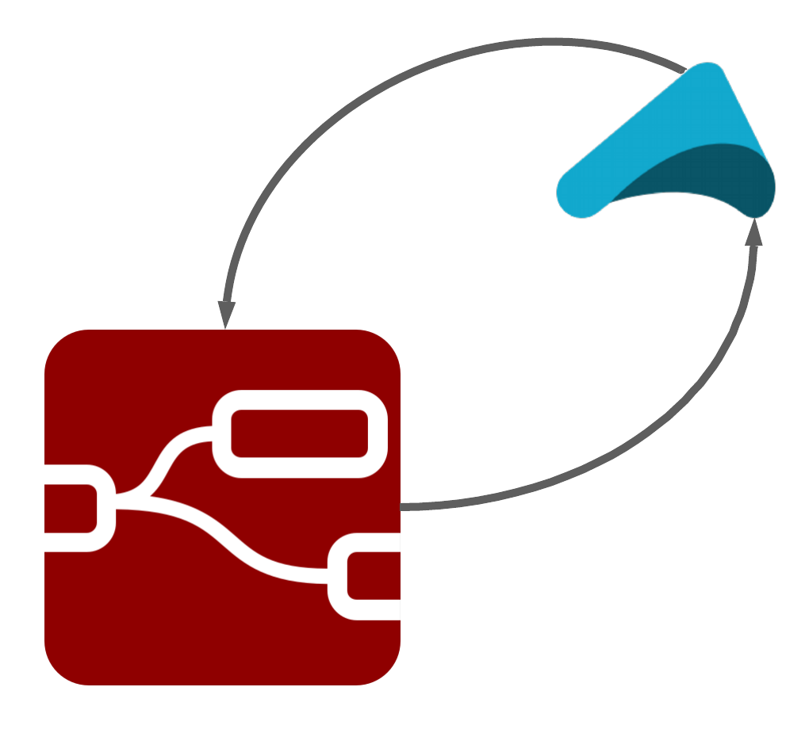
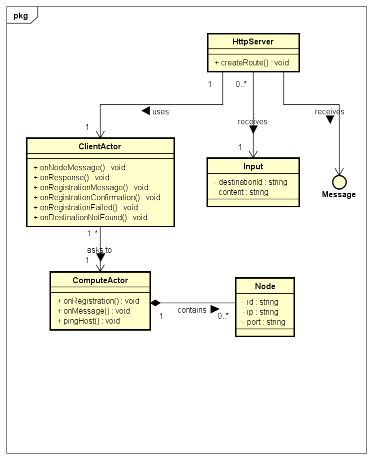
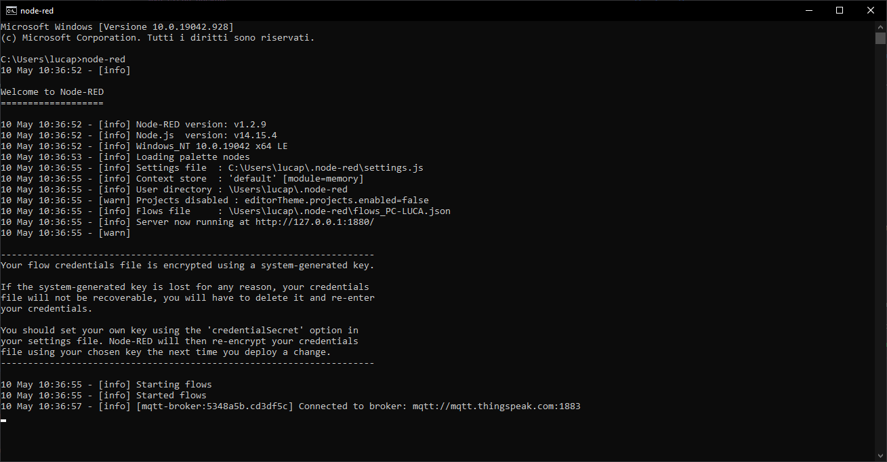

# Akka-Red: Node-Red with Apache Akka Backend




A simple integration between IBM Node-Red and Apache Akka.

## Description

This project is part of an assignment for Middleware course at Politecnico di Milano Year 2021.

It consists in a distributed Node-Red flows developed with an Akka-written backend.

Each Node flow registers to the backend sending its ID, IP address and port. Whenever a message is directed to that
node, it is sent to the backend and forwarded on the correct socket.

## Specification

Full specification can be found [**here**](../specs/specification.pdf) under Project 2 section.

## Architecture



The general Architecture consists into:

- HttpServer, which receives the register and send request from the node instances,
- ClientActor, which receives the request from the HttpServer and forwards it to a compute actor, which should be on another cluster and which makes the computation, returning a result,
- ComputeActor, which receives the requests from several ClientActors and make a computation relying on the type of request,
- Node and Input, which are Jackson serializer classes and correspond to an HTTP input request.

## Platforms

- [**Apache Akka**](https://akka.io/)
- [**Node-Red**](https://nodered.org/)

## Documentation

You can find detailed documentation at:
- [**Akka Node-Red backend**](https://pirox4256.github.io/node-red-javadocs/)

## Requirements

- [Java JDK 16](https://openjdk.java.net/projects/jdk/16/) (backend).
- [Maven](https://maven.apache.org/)

## Installation

### Client side

**Node-Red**

Official and detailed installation instructions can be found here:
- [Windows](https://nodered.org/docs/getting-started/windows)
- [Linux](https://nodered.org/docs/getting-started/local)
- [NPM-Based System](https://github.com/node-red/linux-installers)
- [Raspberry-Pi](https://nodered.org/docs/getting-started/raspberrypi)


### Server side

Simply download and extract the github release package in your favourite directory.

Once extracted, navigate to the project root directory (P2-Distributed_Node_Red) and type the following command

```mvn clean package```

A new Java JAR Executable will be created in the target directory.

## Running

### Start Node-Red

Once followed installation instruction of Node-Red, open a terminal and type the following command:

```node-red```

The instance will be started as shown in figure.



### Backend

Simply navigate to the target directory inside the backend package and type:

```java -jar <package-name>.jar```

Once started both backend and Node-Red, simply open a web browser, browse http://localhost:1880 and:
- import the existent flows, which can be found [here](.github/json/flows.json)
- start one or more registration flows, on the dedicated tab,
- start one or more sending flows, specifying the destination node.
