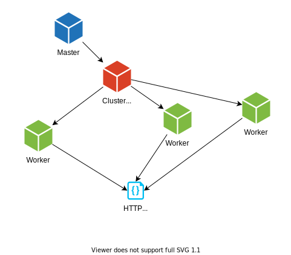

# A Spark application to analyze COVID-19 Data


A simple Spark application in order to understand the COVID-19 weekly trends.

## Description

This project is part of an assignment for Middleware course at Politecnico di Milano Year 2021.

It consists in a realization of a distributed virus spreading data analysis.

It is realized with the Spark suite, written in Java Programming Language.

## Specification

Full specification can be found [**here**](../specs/specification.pdf) under Project 5 section.

## Architecture




## Platforms

- [**Apache Spark**](https://spark.apache.org/)

## Documentation

You can find detailed documentation at:
- [**Spark COVID Analysis**](https://pirox4256.github.io/middleware-spark-javadocs/)

### Design document

You can find the design document [here](https://github.com/ArmelliniFederico/Middleware/blob/main/P5-COVID-19_Analysis/docs/doc5.pdf)

## Requirements

- [Java Programming Language](https://www.java.com/it/)
- [Apache Spark](https://spark.apache.org/)

## Installation

### Apache Spark

Follow the detailed guide realized by a member of our team, Nicolò.
You can find it [here](https://nicolosonnino.it/spark-on-wsl/).

### Repository
Simply clone the repository in a local folder and extract the project directory.

## Running

### Compilation
Open a terminal and go to the project home directory.

Once there, type the following command

`mvn clean package`.

Maven will run the clean and assembly lifecycle, creating the executable jar into the _**target**_ directory.

### Execution
You need to copy the jar into the server in order to start the computation.

The spark master needs to be running and at least one worker.

You can launch the execution on the local machine (if both master and worker run) by running from the bin directory of spark:

```sudo ./spark-submit --class it.polimi.middlewaretechfordistsys.Covid19CaseCount <path-to-the-jar> local[*] <directory-of-data.csv>```

If you want to run the program in cluster mode, you have to set up a master and a worker on different machines, but which can communicate each other. You can follow this [guide](https://www.tutorialkart.com/apache-spark/how-to-setup-an-apache-spark-cluster/).

Once configured, you can run:

```sudo ./spark-submit --class it.polimi.middlewaretechfordistsys.Covid19CaseCount --master spark://<master-ip>:<port> --deploy-mode cluster --supervise --executor-memory <total-memory> --total-executor-cores <total-cores> <path-to-the-jar> local[*] <directory-of-data.csv>```

You will see the worker running from the Spark master web interface, reachable at http://\<master-ip>:8080
