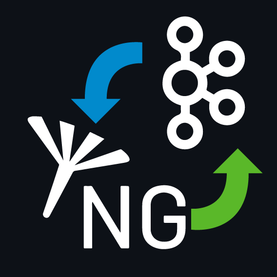

# Contiki-NG with Apache Kafka Contact Tracing

## A simple integration between Apache Kafka and Contiki-NG

This project is part of an assignment for Middleware course at Politecnico di Milano Year 2021.

It consists in a contact tracing implementation using IoT devices with Contiki-NG (with custom processes) and Apache Kafka as the middleware layout for the backend.

Each mote communicates with the other ones using UDP, reports these connections via MQTT to the Kafka cluster, which it stores them into a KSQL db.

At random intervals, the motes send alerts to the broker which then publishes via MQTT the event later caught by each mote involved.

## Specification

Full specification can be found [**here**](../specs/specification.pdf) under Project 1 section.

## Architecture

The general Architecture consists into:

- Contiki motes with a RPL Border Router for communication between them and outsides networks.
- 2 MQTT brokers, one acting in bridge mode and the other one on the remote server.
- 2 Kafka Connect connectors transferring from MQTT topics to Kafka ones.
- Apache Kafka system with a cluster, a broker and multiple topics.
- 2 KSQL streams, one for connections between nodes and the other one for incoming alerts.
- One KSQL table for storing connections.
- One jar program querying the table and instantiating a Kafka producer in order to publish on a topic.

## Platforms

- [**Cooja simulator**](https://github.com/contiki-ng/contiki-ng/wiki/Tutorial:-Running-Contiki%E2%80%90NG-in-Cooja): realtime simulation of Contiki IoT motes.
- [**Confluent Platform**](https://www.confluent.io/product/confluent-platform/): deployment of Apache Kafka with a view to enterprise production and distribution.
- [**Docker**](https://www.docker.com/): easy management of Apache Kafka and Confluent Platform with images and containers.

## Requirements

- [Docker](https://docs.docker.com/get-docker/).
- [Java JDK 16]() (on the remote server).

## Installation

### Client side

**Contiki-NG**
